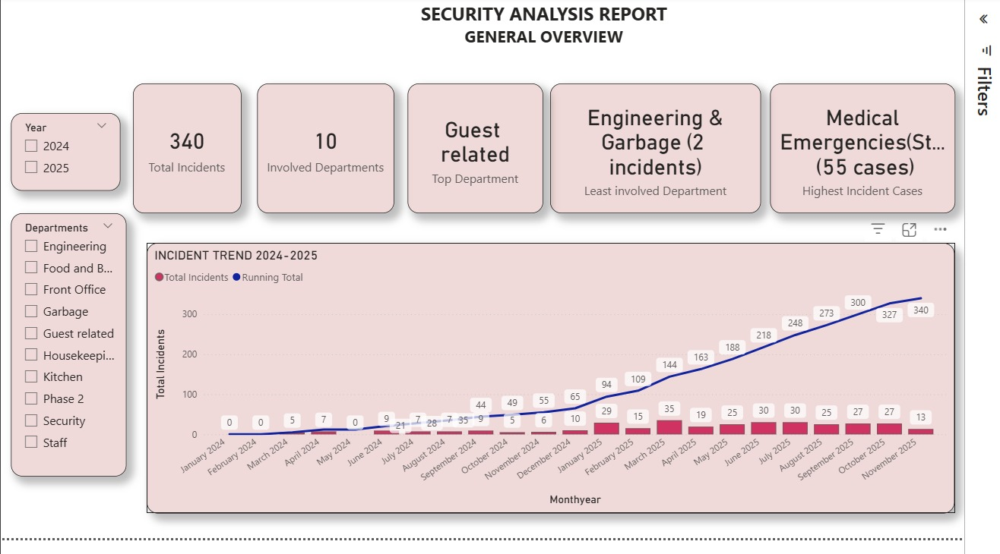
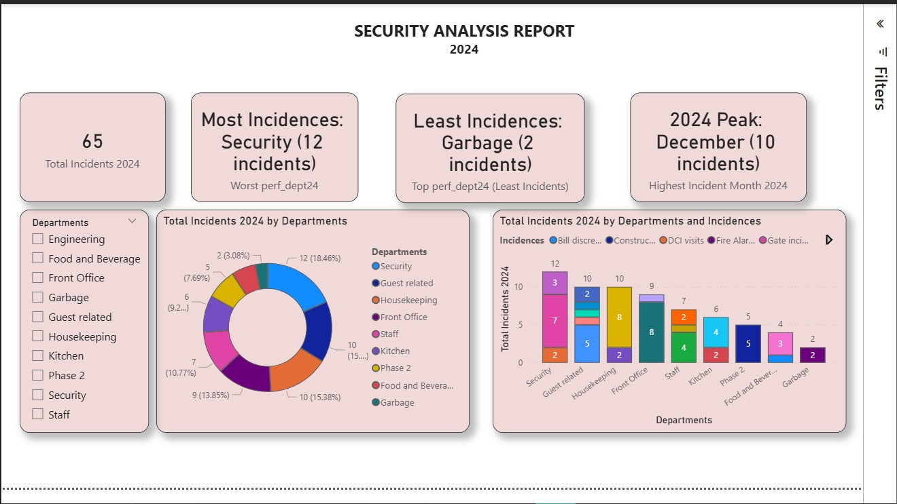
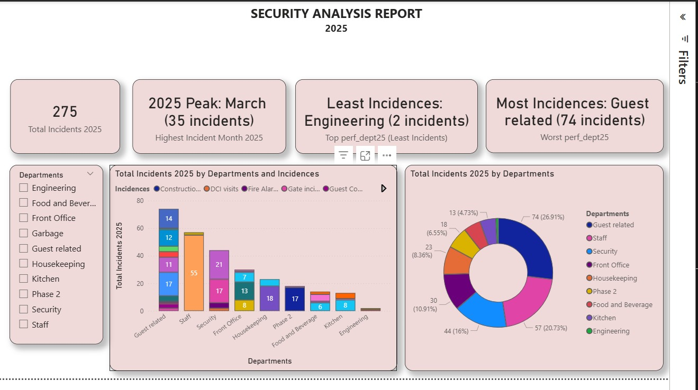
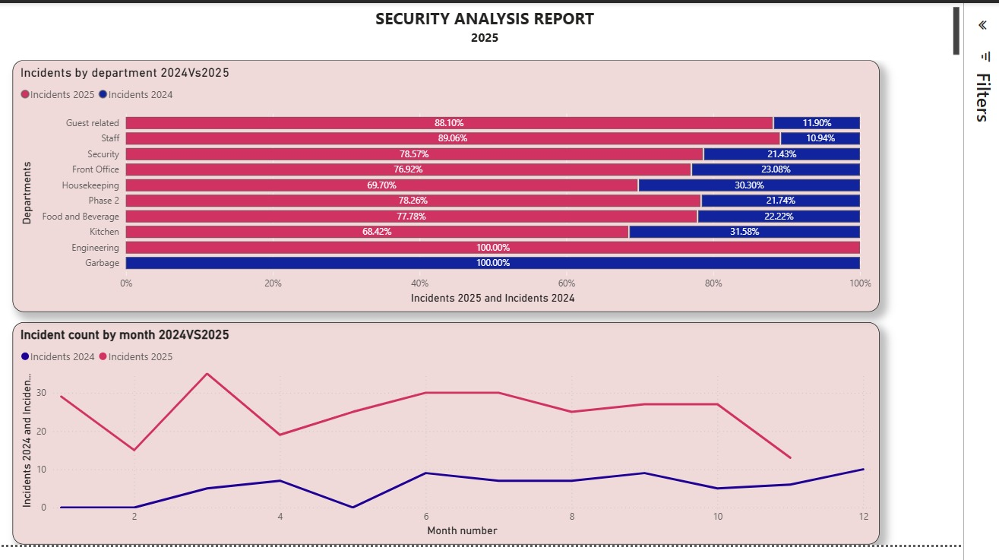

# Hotel_incidents_analysis
This is a project I worked for one of the prestigious hotels in Nairobi. The project contains visualization of the security incidents in the years 2024 & 2025. In handling the project, I undertook data collection, data cleaning, data validation, ETL and data visualization in an aim of getting insights on trends and the best way forward. Below are the visualizations:
## Dashboard preview

